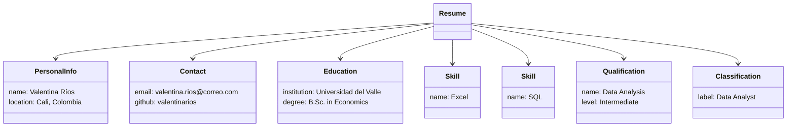

# Parse Tree — resume_02.resume

Ejemplo válido — perfil mínimo: 0 experiencias y sin `phone` (campo opcional).

```mermaid
classDiagram
    class Resume

    class PersonalInfo {
        name: Valentina Ríos
        location: Cali, Colombia
    }

    class Contact {
        email: valentina.rios@correo.com
        github: valentinarios
    }

    class Education {
        institution: Universidad del Valle
        degree: B.Sc. in Economics
    }

    class Skill1["Skill"] {
        name: Excel
    }

    class Skill2["Skill"] {
        name: SQL
    }

    class Qualification {
        name: Data Analysis
        level: Intermediate
    }

    class Classification {
        label: Data Analyst
    }

    Resume --> PersonalInfo
    Resume --> Contact
    Resume --> Education
    Resume --> Skill1
    Resume --> Skill2
    Resume --> Qualification
    Resume --> Classification
```
