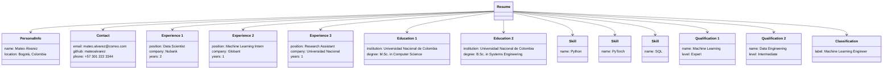

# Parse Tree — resume_03.resume

Valid example — extended profile: 3 experiences, 2 education entries, 3 skills, 2 qualifications.

```mermaid
classDiagram
    class Resume

    class PersonalInfo {
        name: Mateo Álvarez
        location: Bogotá, Colombia
    }

    class Contact {
        email: mateo.alvarez@correo.com
        github: mateoalvarez
        phone: +57 301 222 3344
    }

    class Experience1["Experience 1"] {
        position: Data Scientist
        company: Nubank
        years: 2
    }

    class Experience2["Experience 2"] {
        position: Machine Learning Intern
        company: Globant
        years: 1
    }

    class Experience3["Experience 3"] {
        position: Research Assistant
        company: Universidad Nacional
        years: 1
    }

    class Education1["Education 1"] {
        institution: Universidad Nacional de Colombia
        degree: M.Sc. in Computer Science
    }

    class Education2["Education 2"] {
        institution: Universidad Nacional de Colombia
        degree: B.Sc. in Systems Engineering
    }

    class Skill1["Skill"] {
        name: Python
    }

    class Skill2["Skill"] {
        name: PyTorch
    }

    class Skill3["Skill"] {
        name: SQL
    }

    class Qualification1["Qualification 1"] {
        name: Machine Learning
        level: Expert
    }

    class Qualification2["Qualification 2"] {
        name: Data Engineering
        level: Intermediate
    }

    class Classification {
        label: Machine Learning Engineer
    }

    Resume --> PersonalInfo
    Resume --> Contact
    Resume --> Experience1
    Resume --> Experience2
    Resume --> Experience3
    Resume --> Education1
    Resume --> Education2
    Resume --> Skill1
    Resume --> Skill2
    Resume --> Skill3
    Resume --> Qualification1
    Resume --> Qualification2
    Resume --> Classification
```
