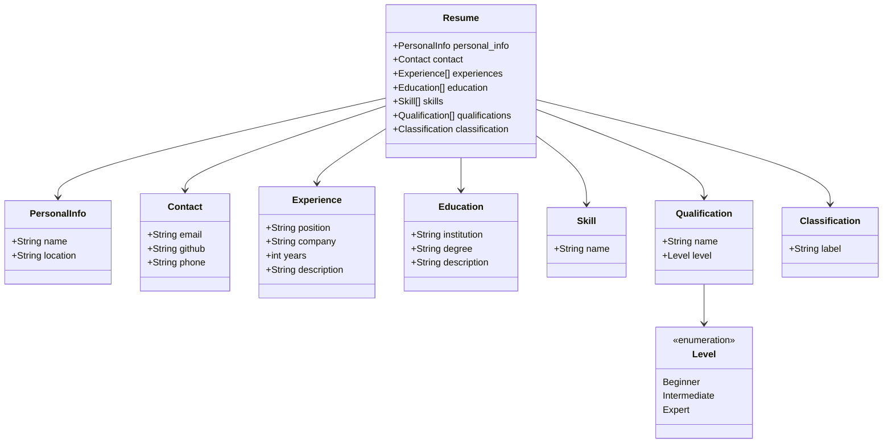

# Metamodel Specification — ResumeLens DSL

This document describes the metamodel generated by textX from `grammar/resume.tx`:
the classes textX creates from the grammar rules, their attributes, and the
relationships among them.

## 1. Overview

Every rule in `resume.tx` that starts with an uppercase letter becomes a Python
class in the metamodel (textX generates these automatically — there is no
hand-written model code). An instance of `Resume` is the root of every parsed
model; all other objects are reached by navigating from it.

## 2. Classes

### 2.1 `Resume` (root class)

The container for a full candidate profile. One `Resume` instance is created
per parsed `.resume` file.

| Attribute | Type | Multiplicity | Description |
|---|---|---|---|
| `personal_info` | `PersonalInfo` | 1 | The candidate's name and location |
| `contact` | `Contact` | 1 | How to reach the candidate |
| `experiences` | `Experience` | 0..* | Professional experience entries, in file order |
| `education` | `Education` | 0..* | Education records, in file order |
| `skills` | `Skill` | 0..* | Informal skill tags |
| `qualifications` | `Qualification` | 0..* | Normalized, leveled qualifications |
| `classification` | `Classification` | 1 | The candidate profile's final classification |

### 2.2 `PersonalInfo`

| Attribute | Type | Description |
|---|---|---|
| `name` | `STRING` | Candidate's full name |
| `location` | `STRING` | City / country the candidate is based in |

### 2.3 `Contact`

| Attribute | Type | Description |
|---|---|---|
| `email` | `STRING` | Candidate's email address |
| `github` | `STRING` | GitHub username |
| `phone` | `STRING` (optional) | Phone number — `None` when omitted |

### 2.4 `Experience`

| Attribute | Type | Description |
|---|---|---|
| `position` | `STRING` | Job title |
| `company` | `STRING` | Employer name |
| `years` | `INT` | Time in the role, in years |
| `description` | `STRING` | Short description of the role |

### 2.5 `Education`

| Attribute | Type | Description |
|---|---|---|
| `institution` | `STRING` | School or university name |
| `degree` | `STRING` | Degree or program name |
| `description` | `STRING` | Short description (focus area, thesis, etc.) |

### 2.6 `Skill`

| Attribute | Type | Description |
|---|---|---|
| `name` | `STRING` | Informal skill tag, e.g. `"Python"` |

### 2.7 `Qualification`

| Attribute | Type | Description |
|---|---|---|
| `name` | `STRING` | Name of the normalized qualification, e.g. `"Machine Learning"` |
| `level` | `Level` | Proficiency level — one of `Beginner`, `Intermediate`, `Expert` |

`Level` is a *match rule* (an enumerated keyword choice), not an object class:
textX resolves it directly to the matched string, so `qualification.level` is
a plain Python string (`"Expert"`, etc.), not an instance of another class.

### 2.8 `Classification`

| Attribute | Type | Description |
|---|---|---|
| `label` | `STRING` | The result of the candidate profile classification, e.g. `"Backend Developer"` |

## 3. Diagram

> Rendered by GitHub automatically (it supports Mermaid in `.md` files). If
> viewing outside GitHub, paste the block into <https://mermaid.live> to see
> it rendered.
